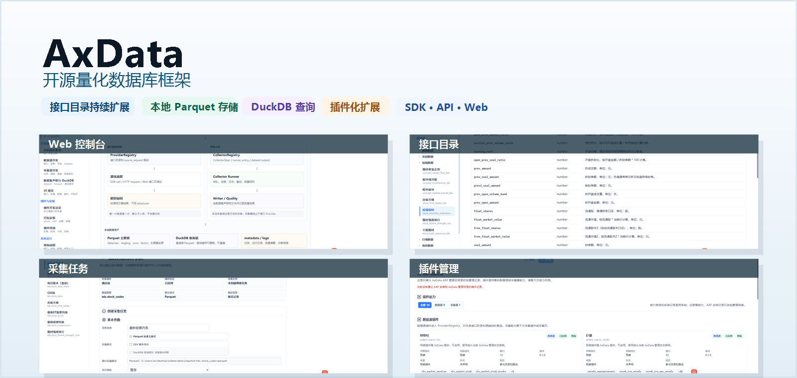
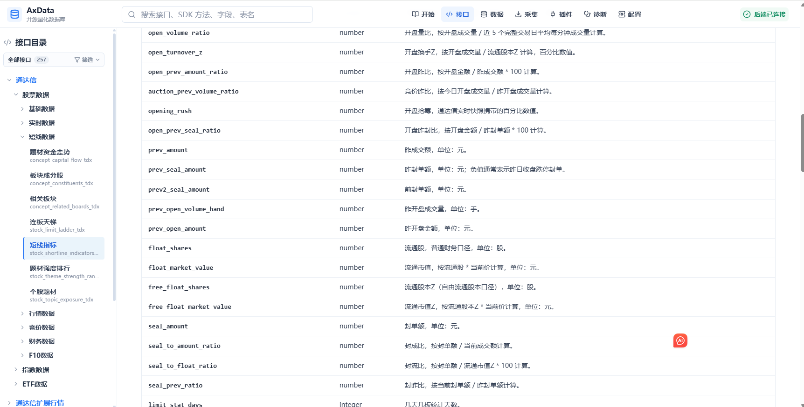
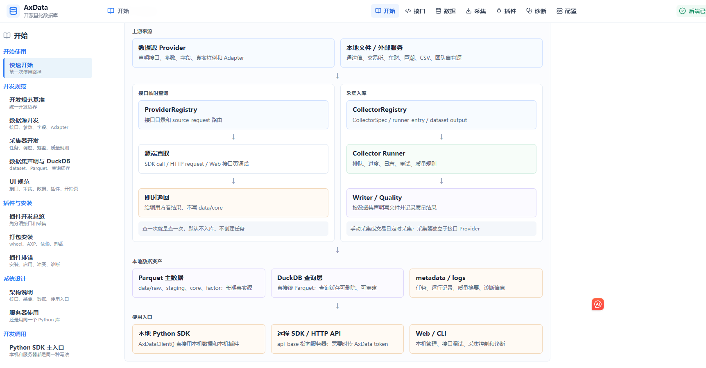
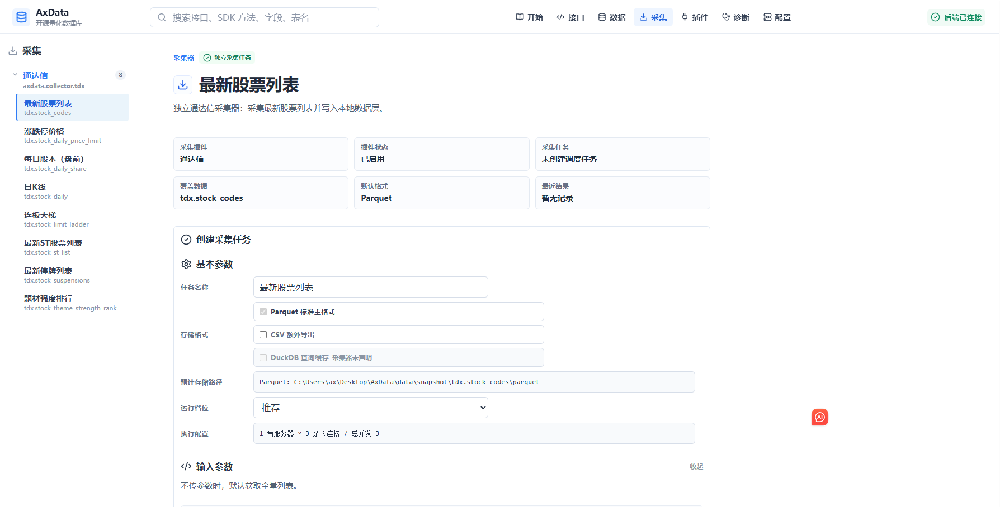
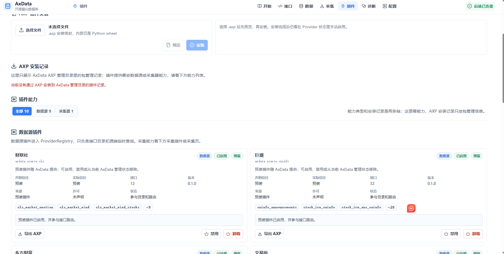

<h1 align="center">AxData</h1>

<p align="center">
  <strong>开源量化数据库框架</strong>
</p>

<p align="center">
  <a href="https://electkismet.github.io/AxData/"><strong>在线文档 / 接口文档</strong></a>
  ·
  <a href="https://electkismet.github.io/AxData/interfaces/">接口一览</a>
</p>

<p align="center">
  <a href="https://github.com/electkismet/AxData/actions/workflows/ci.yml"></a>
  <a href="https://electkismet.github.io/AxData/"></a>
  
  <a href="./LICENSE"></a>
</p>



## 项目简介

> AxData 是一个 **开源量化数据库框架**，将 `数据源接口`、`采集任务`、`开放文件存储`、`本地查询`、`插件管理`、`Python SDK`、`HTTP API` 和 `Web 控制台` 集合在同一个可扩展的数据平台里。
>
> 项目主要面向 **个人量化研究**、**本地数据管理** 和 **数据源插件开发**。

本项目前身为 `eltdx`，因此当前主要数据源和基础采集能力优先围绕通达信体系建设；同时默认数据源能力覆盖交易所、通达信、通达信扩展行情、巨潮、腾讯财经、新浪财经、东方财富、财联社、开盘红等公开源接口。由于接口目录会持续扩展，默认采集插件只内置少量稳定示例；有长期入库需求的接口，可以按数据源插件或采集器插件规范自行编写。欢迎开发者通过 AXP 分享插件，或提交 PR 将成熟数据源或采集器合并进项目。

## 致谢与使用声明

> [!IMPORTANT]
> 本项目仅是一个开源量化数据库框架，数据接口部分基于互联网公开信息搜集整理。项目不提供商业数据服务，也不代表任何第三方数据源、网站或开源项目的授权。

感谢以下开源项目为本项目的数据源接口研究和实现提供参考：

| 参考项目 | 主要参考方向 |
| --- | --- |
| [rainx/pytdx](https://github.com/rainx/pytdx) | TDX 协议研究和 Python 实现 |
| [akfamily/akshare](https://github.com/akfamily/akshare) | 巨潮、腾讯财经、新浪财经等公开财经数据接口整理 |
| [fleetinglife/levistock](https://github.com/fleetinglife/levistock) | 东方财富、财联社、开盘红等 A 股公开数据接口整理 |

**完整使用边界**

1. 本项目代码按 Apache-2.0 协议开源，主要面向个人学习、技术研究和本地数据管理场景。
2. 本项目仅是一个开源量化数据库框架，其中数据接口部分基于互联网公开信息搜集、整理和适配。
3. 本项目不提供任何商业数据服务，也不对任何第三方数据的商业使用作出授权。通过本项目访问或获取第三方数据的，用户需自行确认并遵守对应网站、数据源、开源项目或服务协议；因商业使用、付费服务、生产服务、转售或其他用途产生的风险与责任由使用者自行承担。
4. 对第三方服务器或服务的访问，用户需自行遵守相关法律法规、数据源条款及服务协议。
5. 请勿将本项目用于侵犯他人权益、违反监管规定、绕过访问限制或滥用第三方服务的行为。

代码授权见 [LICENSE](LICENSE)；第三方项目、第三方网站和第三方数据源仍归其各自权利人所有，并适用其各自许可证、条款和规则。

## 快速开始

推荐先安装 **完整项目 + Web 控制台**。这一种方式会拉取源码，并准备 Python SDK、CLI、API 和 Web 控制台。

**一行命令安装完整项目**

Windows PowerShell：

```powershell
git clone https://github.com/electkismet/AxData.git AxData; cd AxData; powershell -ExecutionPolicy Bypass -File .\scripts\bootstrap.ps1
```

macOS / Linux：

```bash
git clone https://github.com/electkismet/AxData.git AxData && cd AxData && bash scripts/bootstrap.sh
```

**启动本地 API 和 Web**

Windows PowerShell：

```powershell
.\.venv\Scripts\python -m uvicorn apps.api.main:app --host 127.0.0.1 --port 8666 --reload
npm run dev:web
```

macOS / Linux：

```bash
./.venv/bin/python -m uvicorn apps.api.main:app --host 127.0.0.1 --port 8666 --reload
npm run dev:web
```

**打开 Web 控制台**

```text
http://127.0.0.1:8667
```

完整项目需要本机先具备 3 个运行环境：

| 环境 | 用途 |
| --- | --- |
| Git | 拉取 AxData 源码 |
| Python 3.11+ | 运行 SDK、CLI、API 和后端服务 |
| Node.js 22.12+ 或更新 LTS | 运行和构建 Web 控制台 |

<details>
<summary><strong>运行环境安装示例</strong></summary>

Windows PowerShell：

```powershell
winget install --id Git.Git -e
winget install --id Python.Python.3.12 -e
winget install --id OpenJS.NodeJS.LTS -e
```

macOS Homebrew：

```bash
brew install git python@3.12 node
```

Ubuntu / Debian：

```bash
sudo apt update
sudo apt install -y git python3 python3-venv python3-pip curl ca-certificates
```

Ubuntu / Debian 自带的 `nodejs` 版本可能偏旧；如果 `node --version` 低于 `22.12`，请从 Node.js 官网、NodeSource、nvm/fnm 或系统软件源安装更新的 Node.js。

</details>

如果只需要在脚本、Notebook 或命令行里使用 Python SDK/CLI，可以直接安装 Python 包：

```powershell
pip install axdata
```

`pip install axdata` 面向 Python SDK 和 CLI 使用，会安装 AxData Python 主包、核心依赖，以及随包提供的数据源能力。完整 Web 控制台、接口文档、本地 API 服务和前端源码请使用上面的完整项目安装方式。

## 核心能力

| 能力 | 说明 |
| --- | --- |
| <kbd>数据源插件</kbd> | 提供接口目录、参数字段、真实样例和源端临时请求能力。 |
| <kbd>采集器插件</kbd> | 将需要长期保存的数据写入本地 Parquet 数据资产。 |
| <kbd>本地数据层</kbd> | `raw -> staging -> core -> factor`，以 Parquet 作为事实源。 |
| <kbd>统一查询</kbd> | DuckDB、Python SDK、CLI、HTTP API 和 Web 使用同一套契约。 |
| <kbd>AXP 分享</kbd> | 数据源接口、采集器和 Web 内容跟随插件声明，可安装、导出和分享。 |

## Python SDK

本地模式默认直接读取当前机器的数据目录和本机插件，不需要先启动 HTTP 服务。

```python
import axdata as ax

client = ax.AxDataClient()

stocks = client.stock_basic_exchange(
    exchange="SSE",
    fields=["instrument_id", "name", "region", "company_full_name"],
)

quote = client.call(
    "stock_realtime_snapshot_tdx",
    code="000001.SZ",
    fields=["instrument_id", "last_price", "change_pct"],
)
```

`client.call(...)` 默认只请求源端一次，不创建采集任务，也不写入本地数据层。需要远程调用时，可连接已启动的 AxData API：

```python
import axdata as ax

remote = ax.AxDataClient(api_base="http://192.168.1.20:8666")
stocks = remote.stock_basic_exchange(exchange="SZSE", fields=["instrument_id", "name", "list_date"])
```

## 界面预览

### 接口目录与字段说明



<details>
<summary>展开更多界面截图</summary>

### 开始页与架构边界



### 采集任务



### 插件管理



</details>

## 采集与本地数据

AxData 的稳定数据资产以 Parquet 为事实源。采集任务会记录任务、运行、输出路径、行数、字段、日期范围、质量状态、日志和错误分类。

```powershell
.\.venv\Scripts\axdata data list
.\.venv\Scripts\axdata data inspect daily
.\.venv\Scripts\axdata data preview daily --limit 20
.\.venv\Scripts\axdata query daily --symbol 000001.SZ --start 20240101 --end 20240131 --limit 100
```

当前默认采集器目录为 TDX 8 个独立采集器，主要用于验证采集链路、提供基础示例和覆盖常用核心数据。默认任务保持小样本参数，不会一键全市场重采。更多接口可以按同一套采集器规范扩展为独立采集器插件。

## 插件体系

AxData 插件是本地安装、本地启用、本地运行的 Python 扩展包。

| 文件 | 作用 |
| --- | --- |
| `axdata-provider.json` | 数据源 Provider 插件，提供接口目录和源端临时请求。 |
| `axdata-plugin.json` | 多能力插件或采集器插件，提供采集器声明、运行入口、输出数据集等能力。 |
| `.axp` | 本地安装信封，可包含 wheel、manifest、README、LICENSE、checksum 和依赖 wheels。 |

数据源插件和采集器插件可以独立存在：只想提供临时查询时写数据源插件；需要写入本地数据库时再写采集器插件。成熟插件可以导出为 AXP 分享给其他 AxData 用户，也可以提交 PR 合并到项目内置插件中。

```powershell
.\.venv\Scripts\axdata plugin list --json
.\.venv\Scripts\axdata plugin installed --json
.\.venv\Scripts\axdata plugin collectors --json
.\.venv\Scripts\axdata plugin axp-preview C:\path\to\plugin.axp --json
.\.venv\Scripts\axdata plugin axp-install C:\path\to\plugin.axp --json
```

插件卸载不会删除已采集数据、metadata、任务或 run history，只会让插件贡献的接口、采集器、下载器和任务模板从当前可用能力中消失。

## 真实源小样本检查

默认测试不请求真实网络。真实源小样本检查必须显式启用，并建议写到临时目录。

```powershell
.\.venv\Scripts\python scripts\smoke_real_sources.py --json

.\.venv\Scripts\python scripts\smoke_real_sources.py --run `
  --interfaces tencent_realtime_snapshot `
  --output-dir $env:TEMP\axdata-real-source-smoke `
  --json
```

`pass` 表示真实源返回小样本、写出 Parquet、质量检查通过且 DuckDB 能读回；`skip` 通常表示未安装、未启用、状态异常或未显式运行；`fail` 通常表示网络、上游、参数或限流问题。

## 目录结构

```text
data/
  raw/       上游原始快照
  staging/   标准化中间层
  core/      稳定用户表
  factor/    因子和研究数据
metadata/
  collector/
  manifests/
  quality/
cache/
logs/
plugins/
```

`data/`、`metadata/plugins.json`、`metadata/*.sqlite`、`metadata/*.db`、`cache/`、`logs/` 都是本地运行产物，不应提交。

## 文档

| 用户入口 | 插件开发 |
| --- | --- |
| [快速开始](docs/quickstart.md) | [数据源插件开发](docs/source-provider-development.md) |
| [文档目录](docs/README.md) | [采集器插件开发](docs/collector-plugin-development.md) |
| [架构设计](docs/architecture.md) | [插件协议](docs/plugin-spec.md) |
|  | [AXP 打包与安装](docs/axp-packaging-guide.md) |

## 开发与验证

```powershell
.\.venv\Scripts\python -m pytest -q
npm run lint:web
npm run build:web
.\.venv\Scripts\python -m compileall -q libs\axdata_core apps\api packages\axdata-sdk services scripts tests
```
