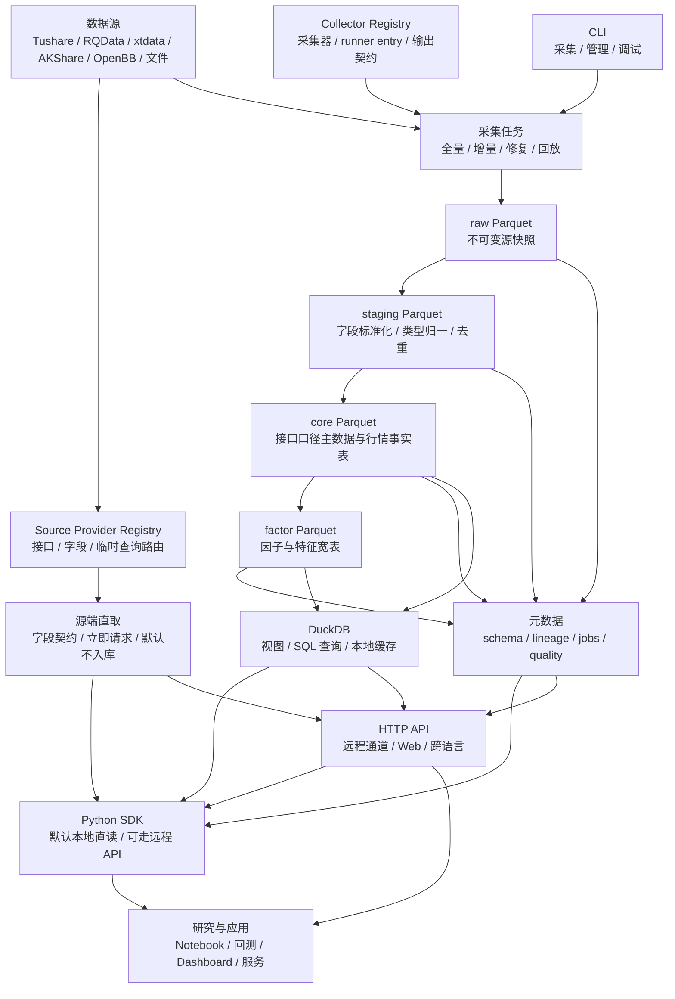

# AxData 架构设计

本文说明 AxData 的整体架构、模块边界和部署形态。AxData 是本地优先的量化数据底座：个人研究可以在单机目录内完成，团队共享可以通过局域网 API 扩展，云端部署可沿用同一套数据语义。

## 目标

- 本地优先：单机即可完成源端直取、采集、存储、查询、因子计算和回测数据供给。
- 数据可追溯：每次写入都能通过 metadata/manifest 追到采集任务、批次、运行参数、处理版本和质量检查结果。
- 接口统一：无论底层来自 Tushare、RQData、xtdata、AKShare、OpenBB 扩展还是自有文件，用户优先使用同一套 Python SDK；HTTP API 是远程访问、Web 控制台和跨语言集成的通道。
- 存储开放：以 Parquet 作为长期数据文件，以 DuckDB 作为本地查询执行层，避免早期绑定重型数据库。
- 渐进部署：同一套核心模型可从桌面目录升级到局域网服务，再升级到云端多租户。

当前边界：

- 当前版本不追求覆盖所有资产类别。
- 当前版本不提供高频 tick 的完整历史归档。
- 不把第三方源的 token、额度、权限模型直接暴露给最终用户 API。

## 整体架构



## 模块边界

- Source Adapter：封装第三方数据源的认证、分页、字段选择、限流、重试和原始响应解析。适配器只负责拿到源数据，不输出 AxData 的核心表。
- Source Provider Registry：记录每个源 Provider 支持的市场、资产、频率、接口、字段、权限要求、更新时点、可靠性等级和调用性质；它只负责接口目录和临时查询路由，不再作为采集器 catalog 的事实源。
- Collector Registry：记录独立 Collector 插件、collector specs、runner entry、资源组、输出数据集和质量契约；它支持 collector-only 插件，并兼容导入旧 Provider manifest collectors。
- Source Request Gateway：按 AxData 接口契约直接请求源端，完成参数校验、协议调用、字段归一和响应包络；默认不写入任何数据层。
- Ingestion Engine：执行采集计划，支持按表、日期、标的、交易所切片；产出 raw 快照和采集日志。
- Transform Pipeline：将 raw 转为 staging，再转为 core；所有类型转换、代码规范、日历对齐、接口口径整理和复权处理都在这里完成。
- Storage Manager：管理 Parquet 路径、分区、schema 版本、manifest、压缩、文件合并和过期策略。
- Query Engine：基于 DuckDB 暴露 SQL、表查询和便捷接口；默认只读 core 与 factor。Python SDK 本地模式默认使用这一层直接读取本机 Parquet/DuckDB 视图。
- Python SDK：用户主入口。默认不需要本地 HTTP 服务，直接读取本机 AxData 数据目录；传入 `api_base` 时切换为远程 HTTP API 客户端，读取目标 AxData 服务的数据。
- HTTP API：远程 SDK/API 通道，同时服务本机 Web 控制台和非 Python 客户端；它不定义另一套产品语义，只承载 SDK 同一套查询与管理能力。
- CLI：面向初始化、采集入库、修复、导出和管理任务；不作为研究取数主入口。
- Metadata Service：维护数据血缘、任务状态、质量报告、schema 版本、manifest 和可用区间。

## 插件化边界

AxData 的插件体系以本地优先为前提：插件是用户本地安装、本地启用、本地运行的 Python 扩展包，用户自行选择来源并承担运行风险。AxData 不做中心化插件市场、不做插件审核、不做签名信任体系；checksum 只用于 `.axp` 文件完整性和打包一致性检查。

插件不只等于数据源。一个插件可以提供 Provider、Collector、DownloaderProfile、工具能力，或这些能力的组合。核心边界如下：

- `axdata-core` 保持中立，只提供数据库、插件协议、Registry、AXP 管理、依赖提示、Collector/Downloader 框架、Writer、Quality、Storage 和 API 契约；Core 不包含不可卸载的数据源。
- 随 AxData 提供的数据源是预装插件，而不是 core 内置能力；预装插件可启用、禁用、逻辑卸载和重新启用。
- Provider 插件提供接口、参数、字段、样例和 Adapter，进入 Source Provider Registry；源端直取默认不入库。
- Collector 插件提供 CollectorSpec、runner entry、输出数据集、资源组和质量契约，进入 Collector Registry；它可以不提供 Provider，也不要求存在对应 `interface_name` 或 `downloader_profile`。
- Collector Runner 通过 `runner_entry` 执行新采集器，统一排队、状态、日志、取消、失败退避、资源组、写入锁、Writer、Quality 和 metadata。新 runner 不通过 `/v1/request`、SDK `call`、ProviderRegistry interface route 或旧 DownloaderProfile -> Adapter 链路。
- DownloaderProfile 和 RequestPlanner 描述旧接口下载路径如何拆请求、控制并发、调用 Adapter、写 Parquet 和做质量检查；它们继续服务 legacy collectors，但不是新采集器身份。
- 插件依赖默认离线处理；AxData 负责安装前提示缺失依赖、版本风险和包内 wheels，不负责复杂自动冲突治理。
- 插件卸载不会删除已采集 Parquet、metadata、用户创建的 Task 或 Run History；Provider 插件贡献的接口/下载器会从 Source Provider Registry 消失，Collector 插件贡献的采集器/task template 会从 Collector Registry 消失。两者独立启停、独立卸载。
- TDX、TDX Ext、交易所、腾讯、巨潮、东方财富、新浪等具体数据源都按源插件管理；TDX 普通行情、F10、服务器列表、缓存和采集 profile 由 `axdata-source-tdx` / `axdata-source-tdx-ext` 承载，core 不保留可运行兜底能力。

截至 2026-07-04，默认 CollectorRegistry catalog 为 8 个 independent / non-legacy collectors，均由 `axdata.collector.tdx` 提供。交易所保留为 Source Provider 接口和本地基础数据能力，不再提供默认 CollectorSpec；`stock_capital_changes_tdx` 与 `stock_adj_factor_tdx` 保留为源端接口和兼容 DownloaderProfile，不再作为采集器进入采集页。巨潮、腾讯、东方财富和新浪财经仍是 source_request Provider 接口，默认不提供采集器。

## 数据流

AxData 有两条读数路径。

源端直取路径：

1. SDK 或 HTTP API 指定 AxData 接口名，例如第一版源端预览接口 `stock_codes_tdx`。
2. Source Request Gateway 读取接口契约，校验参数和字段。
3. 适配器请求源端，协议层解析原始响应。
4. 归一层返回 AxData 字段、中文说明和响应包络。
5. 默认不写入 `raw`、`staging`、`core` 或 `factor`。

采集入库路径：

1. 采集任务读取 Collector Registry，解析 `collector_id`、`collector_plugin_id`、`dataset_id`、`runner_entry`、资源组、输出和质量契约。
2. Collector Runner 在 AxData 队列和资源池下调用 `runner_entry`。新采集器可以自带取数逻辑、请求上游、读取本地文件或复用公共库，但不得通过 `/v1/request`、SDK `call`、ProviderRegistry route 或旧 DownloaderProfile 链路套接口采集。
3. Writer 将采集器产出的记录按 raw/staging/core/factor 规则写入 Parquet，并写入批次元数据。兼容的旧 Provider manifest collectors 仍可通过 DownloaderProfile -> Adapter -> Writer 路径执行，但必须标记为 legacy。
4. staging 层执行字段整理、类型转换、代码标准化、日期规范、基础去重。
5. core 层按数据集或接口口径形成稳定、面向业务语义的主表和事实表，例如 `stock_basic_exchange`；新增口径应使用独立表名或接口名表达。
6. factor 层从 core 层生成因子，记录计算窗口、依赖表、代码版本和数据截止点。
7. DuckDB 以外部表或视图方式查询 Parquet，为 SDK 的本地直读、HTTP API 服务、Notebook 和回测提供一致语义。

采集与实时数据的边界：

- 采集是入库动作：只要称为采集，就必须产生批次元数据，并按 raw、staging、core/factor 的规则写入本地数据目录。
- 查询是读库动作：`query`、本地表查询和便捷历史查询默认只读已入库数据。
- 源端直取是即时请求动作：`request` 或 `client.call(...)` 可以临时请求源端，返回 AxData 字段，但默认不入库。
- 实时行情、快照和订阅默认不入库，只作为临时数据流或内存态视图；如需持久化，必须显式启动采集/录制任务并写入独立批次。

## 本地优先部署形态

本地版默认是一个目录、一组 Parquet 文件和一个可选的 DuckDB 元数据/缓存文件：

```text
axdata-home/
  data/
    raw/
    staging/
    core/
    factor/
  metadata/
    catalog.duckdb
    manifests/
    quality/
  logs/
  cache/
```

本地部署原则：

- 默认监听 `127.0.0.1`，不开启远程访问。
- AxData 自有 token 只用于本机以外的访问鉴权；第三方源凭据由对应 Provider 和用户运行环境自行处理，AxData core 不托管、不注入、不代理。
- 远程访问可使用单个 `AXDATA_API_TOKEN`，也可创建多个命名设备 token；命名 token 保存在本机 `metadata/api_tokens.json`，Web 默认隐藏、点击显示，丢失设备时删除对应 token。
- Web 控制台只作为本机管理台，固定监听本机回环地址；不提供远程 Web 入口。其他机器应通过 Python SDK 或 HTTP API 访问 `8666`。
- Parquet 是数据真相来源；DuckDB 可重建，不作为唯一存储。
- 对研究者优先暴露 Python SDK；SDK 默认本地直读 Parquet/DuckDB，HTTP 本地端口主要服务本机 Web、远程 SDK/API 和跨语言调用。
- 任务调度可以从简单 cron 或本地命令开始，也可以替换为服务化 scheduler。

## 局域网部署形态

局域网版在本地版基础上增加一个常驻 API 服务和共享存储：

- API 服务部署在工作站或内网服务器，作为远程 SDK/API 访问同一数据目录的通道。
- `data/` 目录位于 NAS、本机高速盘或共享对象存储。
- 读请求可多用户并发，写请求仅由采集任务和管理员执行。
- 使用 AxData 自有 token 做用户鉴权；第三方源凭据留在服务端 Provider 自己的运行环境中，不进入最终用户 API、响应、日志或导出文件。
- 建议为每台研究电脑、Notebook 或自动化脚本创建独立命名 token；Python SDK 通过 `token=` 或 `AXDATA_TOKEN` 发送 Bearer token。Web 控制台只管理本机 AxData，不提供连接其它 API 的产品入口。
- DuckDB 可按服务实例维护本地查询缓存，也可只通过 Parquet 外部表查询。
- Python SDK 在局域网模式下通过 `api_base` 指向内网 API；脚本代码保持同一套方法名和字段语义。

## 云端部署形态

云端版保持同一套表结构和 API 语义，只替换运行组件：

- Parquet 可升级到对象存储。
- 采集任务可升级到队列和任务工作进程。
- API 前置网关、限流、访问记录和用户管理。
- 元数据可从本地 DuckDB/文件升级到托管数据库。
- 质量报告、任务日志和指标接入云端观测系统。
- 对外发布时区分只读数据 API、管理 API 和后台采集 API；Python SDK 继续作为推荐客户端，通过 `api_base` 接入云端服务。

## 参考系统取舍

| 系统 | 借鉴点 | 不直接照搬的原因 |
| --- | --- | --- |
| Tushare | `api_name + params + fields` 的统一调用模型、清晰的 token 认证、A 股字段命名习惯 | AxData 不把第三方接口形态作为核心事实模型；额度、积分、权限只属于 source adapter |
| RQData | 专业数据源的稳定标的编码、Python/HTTP 双入口、交易日函数和多资产数据模型 | 不采用当天 token 或 CSV 响应作为 AxData 核心协议；返回统一 JSON/Arrow/Parquet |
| xtdata | 本地终端桥接、历史补充与实时订阅分离、桌面环境可用 | 不让核心服务依赖 MiniQMT 进程；xtdata 只作为边缘采集源或实时补充源，实时默认不写入 core |
| AKShare | 开源、覆盖广、DataFrame 友好、适合交叉校验和低成本补充 | 多数接口依赖公开网页或第三方站点稳定性，不能作为唯一权威源 |
| OpenBB | 扩展式数据接入、统一入口、多前端形态、凭据集中管理 | AxData 当前聚焦本地 A 股数据底座，不追求金融全品类聚合平台 |
| Qlib | 数据层、因子层、研究/回测衔接、点时数据意识 | 不以 Qlib `.bin` 作为主存储；AxData 使用开放 Parquet，并可向 Qlib 格式导出 |

源端接口目录、字段先行策略和实时/直取边界按实际需求逐个补充。

参考链接：

- [Tushare HTTP 协议](https://tushare.pro/document/1?doc_id=40)
- [RQData Python API](https://www.ricequant.com/doc/rqdata/python/generic-api)
- [RQData HTTP API](https://www.ricequant.com/doc/rqdata/http/data-process)
- [xtdata 行情模块](https://dict.thinktrader.net/nativeApi/xtdata.html)
- [AKShare 文档](https://akshare.akfamily.xyz/)
- [OpenBB 文档](https://docs.openbb.co/)
- [Qlib Data Layer](https://qlib.readthedocs.io/en/latest/component/data.html)

## 架构原则

- 源数据和产品接口解耦：第三方源变化不应迫使调用方修改代码。
- 接口即口径：用户接口名表达数据口径和来源；当前源端直取保留通达信与交易所两类入口，例如 `_tdx` 和 `_exchange`。
- 源端目录分离：通达信和交易所保留各自接口目录、原始数据目录和特色字段；源目录下再按股票数据、ETF 数据、指数数据等资产大类分层；进入 core 后才输出统一用户语义。
- Python SDK 是用户主入口：本地研究默认直读本机数据目录，远程共享才通过 `api_base` 走 HTTP API。
- HTTP API 是通道而不是产品入口本体：它承载远程、Web 和跨语言访问，不改变字段、表和错误语义。
- 每层只做一类事情：raw 保存，staging 标准化，core 统一语义，factor 生成特征。
- 本地可解释优先：文件、SQL、日志和 manifest 都应能被人直接检查。
- 字段先行，存储后置：新源先完成接口目录、参数、字段和源端直取，再为适合沉淀的数据补采集入库。
- 写入少而准，读取快而宽：采集任务严格校验，查询层偏向宽表和批量读取。
- 采集才入库：实时订阅、源端预览和临时调试默认不落盘，只有显式采集/录制任务才写入 raw/staging/core/factor。
- 非实时不保活：普通源端直取用短连接/请求级连接；心跳和常驻连接只在实时行情、订阅或长连接采集任务中启用。
- 复权可重算：保留未复权价格和复权因子，前复权/后复权视图由查询层或因子层派生。
- 失败可恢复：任何采集批次都能重放，任何衍生层都能从上游重新生成。

## 关键设计决策

- 统一代码格式：A 股使用 `000001.SZ`、`600000.SH`、`430047.BJ` 这类后缀格式，源适配器负责与各源编码互转。
- 日期格式：API 和当前 core 层统一使用 `YYYYMMDD` 字符串，HTTP 层兼容 ISO 日期输入；如切换 Parquet `date` 类型，必须由 schema 版本显式标记。
- 价格存储：core 层 `daily` 保存未复权 OHLC，`adj_factor` 单独保存复权因子。
- 单表粒度：日频事实表以 `ts_code + trade_date` 为主键；分钟线可扩展为 `ts_code + trade_time + frequency`。
- 采集追溯隔离：task、batch、run、adapter、参数和质量结果写入 metadata/manifest，不进入常规用户 schema。
- Schema 演进：只允许向后兼容地增加字段；字段改名、单位变化、语义变化必须新建 schema 版本。
